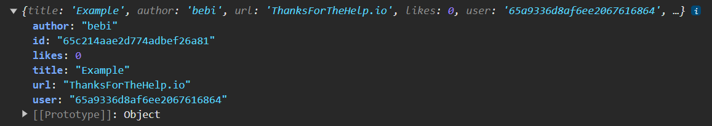
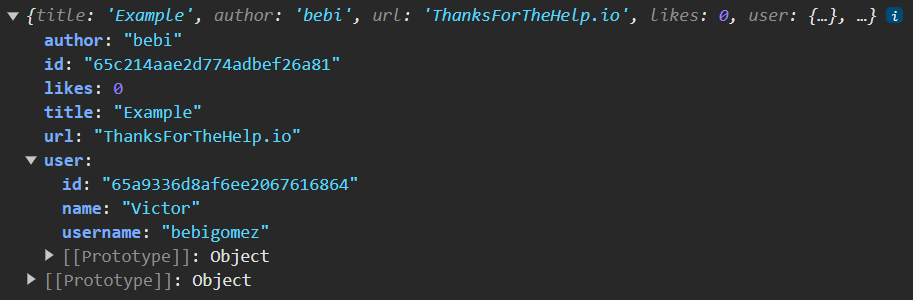

# Delete Button Problem

Hello friends!

While working on the final tests from part 5, I realized that I have an issue: After adding a blog, I can see that the blog is added, but when I click on its Show button, I don't see the Delete button, even though I'm performing this validation:

```jsx
{(blog.user.id === loggedUser.id) ? (
            <button id='delete-button' onClick={handleDeletion}>delete</button>
          ) : null}
```

However, after refreshing the page, everything works correctly, but there’s a new problem: when I press the Like button, the Delete button disappears again.

Using some console.logs, I could see that the problem seems to be that the structure of the variable blog is different before and after refreshing the page:

Before refreshing the page:



After refreshing the page:



I managed to get the app to achieve the desired behavior by modifying the validation as follows:

```jsx
{(blog.user === loggedUser.id || blog.user.id === loggedUser.id) ? (
            <button id='delete-button' onClick={handleDeletion}>delete</button>
          ) : null}
```

But I have a feeling that this may not be the right way to go.

I created this temporary repo containing both the frontend and backend so that you can see the rest of the code I currently have.

Thank you so much for taking the time to help me, I really appreciate it.
